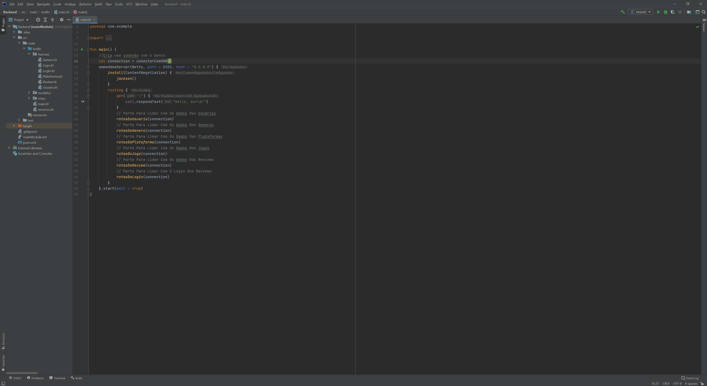

# Projeto T3_T4 - ECM251 Linhguagens de Programação 1

## Backend (API):

No backend há duas partes, o banco de dados e a API escrita em Kotlin.

### 1. Passos Para Criar O Banco De Dados
Para criar o banco de dados instale o Docker Compose e coloque o seguinte comando no sistema:

```
docker-compose up
```

### 2. Espere Até O Final Da Inicialização Do Banco (Isso Pode Demorar Até Dois Minutos)

A seguinte linha indicará que o mesmo está pronto para uso:


### 3. Abra A Pasta "Backend" no Intellij E Aperte Para Rodar


# Consumindo A API

## POST /usuario

Exemplo de JSON Body:

```
{
	"nome" : "Fernando",
	"sobrenome" : "Padilha Farah",
	"email" : "teste@teste.br",
	"senha" : "teste"
}
```

Exemplo de JSON Resposta:

```
{
  "status": "aceito",
  "codigo": "F_4xs1P*e9",
  "nome": null,
  "sobrenome": null,
  "email": null,
  "justificativa": null
}
```

## GET /usuario/{código do usuário}

Exemplo de JSON Resposta:

```
{
  "status": "aceito",
  "codigo": "F_4xs1P*e9",
  "nome": "Fernando",
  "sobrenome": "Padilha Farah",
  "email": "teste@teste.br",
  "justificativa": null
}
```

## PUT /usuario

Exemplo de JSON Body:

```
{
	"codigo" : "F_4xs1P*e9",
	"nome" : "Fernando",
    "sobrenome": "Padilha Farah",
	"email" : "teste@teste.br",
	"senha" : "teste"
}
```

Exemplo de JSON Resposta:

```
{
  "status": "aceito",
  "codigo": "F_4xs1P*e9",
  "nome": null,
  "sobrenome": null,
  "email": null,
  "justificativa": null
}
```

## POST /login

Exemplo de JSON Body:

```
{
	"email" : "teste@teste.br",
	"senha" : "teste"
}
```

Exemplo de JSON Resposta:

```
{
  "status": "aceito",
  "codigo": "F_4xs1P*e9",
  "nome": null,
  "sobrenome": null,
  "email": "teste@teste.br",
  "justificativa": null
}
```

## POST /genero

Exemplo de JSON Body:

```
{
	"nome" : "Genero 1",
	"codigoDoUsuario" : "F_4xs1P*e9",
	"email" : "teste@teste.br",
	"senha" : "teste"
}
```

Exemplo de JSON Resposta:
```
{
  "status": "aceito",
  "generos": [
    {
      "codigo": "m.Dj6S3TMC",
      "nome": "Genero 1"
    }
  ],
  "justificativa": null
}
```

## GET /genero

Exemplo de JSON Resposta:

```
{
  "status": "aceito",
  "generos": [
    {
      "codigo": "m.Dj6S3TMC",
      "nome": "Genero 1"
    }
  ],
  "justificativa": null
}
```

## POST /plataforma

Exemplo de JSON Body:

```
{
	"nome" : "Plataforma 1",
	"codigoDoUsuario" : "F_4xs1P*e9",
	"email" : "teste@teste.br",
	"senha" : "teste"
}
```

Exemplo de JSON Resposta:

```
{
  "status": "aceito",
  "generos": [
    {
      "codigo": ".a78cE2k5H",
      "nome": "Plataforma 1"
    }
  ],
  "justificativa": null
}
```

## GET /plataforma

Exemplo de JSON Resposta:

```
{
  "status": "aceito",
  "plataformas": [
    {
      "codigo": ".a78cE2k5H",
      "nome": "Plataforma 1"
    }
  ],
  "justificativa": null
}
```

## GET /jogo

Exemplo de JSON Resposta:

```
{
  "status": "aceito",
  "codigosDosJogos": [
    "teste",
    "_A69Q!1*P7",
    "i2x26.hVOY"
  ],
  "codigoDoJogo": null,
  "codigoDoUsuario": null,
  "nome": null,
  "clacssificacaoEtaria": null,
  "publisher": null,
  "anoDeLancamento": null,
  "resumo": null,
  "estrelas": null,
  "generos": null,
  "plataformas": null,
  "urlImagem": null,
  "justificativa": null
}
```

## POST /jogo

Exemplo de JSON Body:

```
{
	"codigoDoUsuario" : "F_4xs1P*e9",
	"emailDoUsuario" : "teste@teste.br",
	"senhaDoUsuario" : "teste",
	"nome" : "Jogo 1",
	"clacssificacaoEtaria" : 12,
	"publisher" : "Publisher 1",
	"anoDeLancamento" : 13,
	"resumo" : "Resumo",
	"urlImagem" : null,
	"generos" : ["m.Dj6S3TMC"],
	"plataformas" : [".a78cE2k5H"]
}
```

Exemplo de JSON Resposta:

```
{
  "status": "aceito",
  "codigosDosJogos": null,
  "codigoDoJogo": "PHqE-moUTN",
  "codigoDoUsuario": null,
  "nome": null,
  "clacssificacaoEtaria": null,
  "publisher": null,
  "anoDeLancamento": null,
  "resumo": null,
  "estrelas": null,
  "generos": null,
  "plataformas": null,
  "urlImagem": null,
  "justificativa": null
}
```

## PUT /jogo

Exemplo de JSON Body:

```
{
	"codigoDoJogo" : "PHqE-moUTN",
	"codigoDoUsuario" : "F_4xs1P*e9",
	"emailDoUsuario" : "teste@teste.br",
	"senhaDoUsuario" : "teste",
	"nome" : "Jogo 1",
	"clacssificacaoEtaria" : 12,
	"publisher" : "Publisher 1",
	"anoDeLancamento" : 13,
	"resumo" : "Resumo",
	"generos" : ["m.Dj6S3TMC"],
	"plataformas" : [".a78cE2k5H"]
}
```

Exemplo de JSON Resposta:

```
{
  "status": "aceito",
  "codigosDosJogos": null,
  "codigoDoJogo": null,
  "codigoDoUsuario": null,
  "nome": null,
  "clacssificacaoEtaria": null,
  "publisher": null,
  "anoDeLancamento": null,
  "resumo": null,
  "estrelas": null,
  "generos": null,
  "plataformas": null,
  "urlImagem": null,
  "justificativa": null
}
```

## DEL /jogo

Exemplo de JSON Body:

```
{
	"codigoDoJogo" : "PHqE-moUTN",
	"codigoDoUsuario" : "F_4xs1P*e9",
	"emailDoUsuario" : "teste@teste.br",
	"senhaDoUsuario" : "teste"
}
```

## GET /jogo/{código do jogo}

Exemplo de JSON Resposta:

```
{
  "status": "aceito",
  "codigosDosJogos": null,
  "codigoDoJogo": "PHqE-moUTN",
  "codigoDoUsuario": "F_4xs1P*e9",
  "nome": "Jogo 1",
  "clacssificacaoEtaria": 12,
  "publisher": "Publisher 1",
  "anoDeLancamento": 13,
  "resumo": "Resumo",
  "estrelas": 0.0,
  "generos": [
    {
      "codigo": "m.Dj6S3TMC",
      "nome": "Genero 1"
    }
  ],
  "plataformas": [
    {
      "codigo": ".a78cE2k5H",
      "nome": "Plataforma 1"
    }
  ],
  "urlImagem": null,
  "justificativa": null
}
```

## POST /review

Exemplo de JSON Body:

```
{
	"codigoDoJogo" : "PHqE-moUTN",
	"codigoDoUsuario" : "F_4xs1P*e9",
	"emailDoUsuario" : "teste@teste.br",
	"senhaDoUsuario" : "teste",
	"estrelas" : 3,
	"texto" : "Texto Review"
}
```

Exemplo de JSON Resposta:

```
{
  "status": "aceito",
  "codigoDoJogo": null,
  "codigoDoUsuario": null,
  "estrelas": null,
  "texto": null,
  "justificativa": null
}
```

## PUT /review

Exemplo de JSON Body:

```
{
	"codigoDoJogo" : "PHqE-moUTN",
	"codigoDoUsuario" : "F_4xs1P*e9",
	"emailDoUsuario" : "teste@teste.br",
	"senhaDoUsuario" : "teste",
	"estrelas" : 5,
	"texto" : "Texto Review"
}
```

Exemplo de JSON Resposta:

```
{
  "status": "aceito",
  "codigoDoJogo": null,
  "codigoDoUsuario": null,
  "estrelas": null,
  "texto": null,
  "justificativa": null
}
```

## DEL /review

Exemplo de JSON Body:

```
{
	"codigoDoJogo" : "PHqE-moUTN",
	"codigoDoUsuario" : "F_4xs1P*e9",
	"emailDoUsuario" : "teste@teste.br",
	"senhaDoUsuario" : "teste"
}
```

Exemplo de JSON Resposta:

```
{
  "status": "aceito",
  "codigoDoJogo": null,
  "codigoDoUsuario": null,
  "estrelas": null,
  "texto": null,
  "justificativa": null
}
```

## GET /review/{código do jogo}

Exemplo de JSON Resposta:

```
{
  "status": "aceito",
  "reviews": [
    {
      "codigoDoJogo": "PHqE-moUTN",
      "codigoDoUsuario": "F_4xs1P*e9",
      "estrelas": 3,
      "texto": "Texto Review",
      "data": "2021-10-06 01:46:09"
    },
    {
      "codigoDoJogo": "PHqE-moUTN",
      "codigoDoUsuario": "F_4xs1P*e9",
      "estrelas": 2,
      "texto": "Texto Review",
      "data": "2021-10-06 01:54:89"
    },
    {
      "codigoDoJogo": "PHqE-moUTN",
      "codigoDoUsuario": "F_4xs1P*e9",
      "estrelas": 1,
      "texto": "Texto Review",
      "data": "2021-10-06 01:55:19"
    },
    {
      "codigoDoJogo": "PHqE-moUTN",
      "codigoDoUsuario": "F_4xs1P*e9",
      "estrelas": 4,
      "texto": "Texto Review",
      "data": "2021-10-06 01:58:29"
    }
  ],
  "justificativa": null
}
```